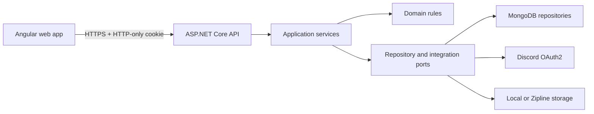

# Architecture

Imperial Estates uses a modular layered backend and a route-feature frontend.

The Domain project owns lifecycle invariants and contains no infrastructure dependency. Application coordinates DTO validation, authorization-independent business rules, status history, and audit events. Infrastructure implements persistence and external systems. API owns transport concerns, authentication, policies, rate limiting, CORS, and error formatting.

Angular uses standalone, lazy-loaded route components. `core` owns singleton services and security plumbing; `shared` owns reusable presentation; public and dashboard layouts provide separate navigation surfaces. Server authorization remains authoritative.

Authentication uses Discord authorization code exchange. The API validates a cryptographically random state cookie, creates or refreshes the employee record, then issues an HTTP-only JWT cookie. Each protected request also checks the current MongoDB approval, access, and role state, so revocation and demotion do not wait for an old token to expire.

Lifecycle operations are domain methods. Tenant assignment and eviction use a Mongo transaction when the deployment supports transactions, with sequential development fallback for standalone Mongo. Production should use a replica set.
